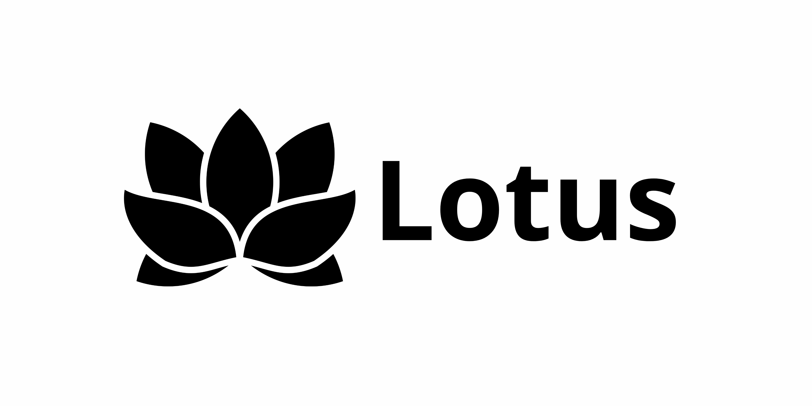

Lotus adalah Panel management yang bekerja seperti Rosecp, Base code menggunakan AllianceJS

---

## Tech

Lotus dibangun dengan full-stack web application **Python**.

* **Backend:** **Python** dengan **Flask** framework.
* **Database:** **PostgreSQL** (via `psycopg2-binary`) dengan **SQLAlchemy**.
* **P&W API Integration:** `pnwkit-py` for querying and mutations.
* **Authentication:** Discord OAuth2.
* **Dependencies:** `Flask-SQLAlchemy`, `requests`, `python-dotenv`, `cryptography`.

---

## Setup

### Prerequisites

Harus Terinstal:

* **Python 3.8+**
* **PostgreSQL** (atau database supported by SQLAlchemy)
* **Discord Application:** Oauth2.
* **P&W API Key:** valid Politics & War API key.
